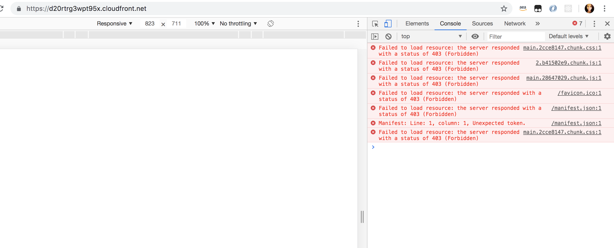
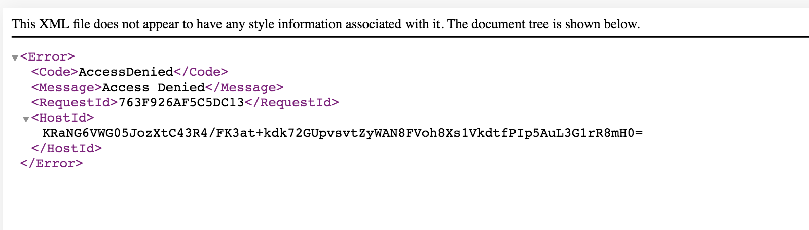

# Deploy cool-react-app by cloudFormation
tasks are to fix each of the six broken CloudFormation templates.
## Template 1
format error: Resource name cool-react-bucket is non alphanumeric.
- Bucket name is cool-react-app
- Not dash in bucket name

## Template 2 
failed to load resource
1.    changed s3 Line#174 from private-read to public-read
2.    changed bucket name from coolReactBucket to coolreactbuckettemp2

## Template 3 – no xml file
1.    Added to lines 40, 41, and 43 - !Ref
2.    changed bucket name from coolReactBucket to coolreactbuckettemp3

## Template 4 
error: instance of Fn::GetAtt references undefined resource codeBuildRoll
1. Missing code build role
    - get the codeBuildRole code from template 1
2. Then get error : instance of Fn::GetAtt references undefined resource coolreactbucke
    - Some place is {coolReactBucket}, some place is  {coolreactbucket}
    - make sure the whole file use the same bucket name
  
## Template 5
 
## Template 6
1. format error: 2020-09-09 is not a supported value forAWSTemplateFormatVersion
    - aws template formation version is 2020

2. GitHub owner and repo is mixed 
    - switch githubOwner and githubRepo
    
3. error: Resource name cool-react-bucket is non alphanumeric
4. Then CodePipeLineRole. CREATE_FAILED.       Invalid principal in policy: "SERVICE":"codepipeiine.amazonaws.com" 
    - Missing !, Misspell codepipeline,  missing ’s’ after 'http',  miss ‘_’ between post and build.